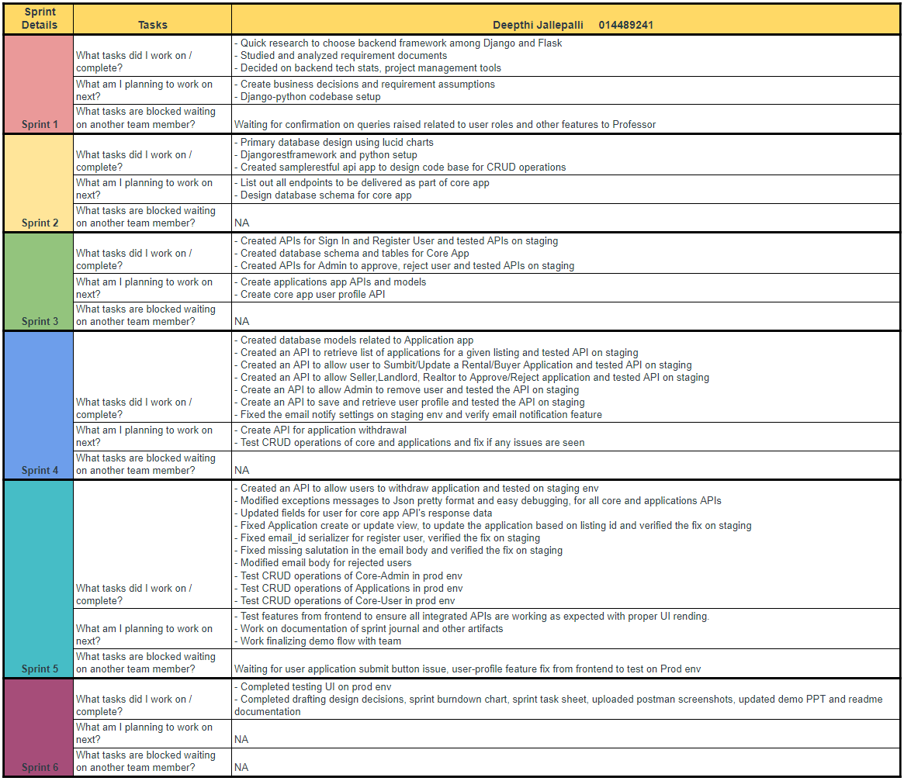
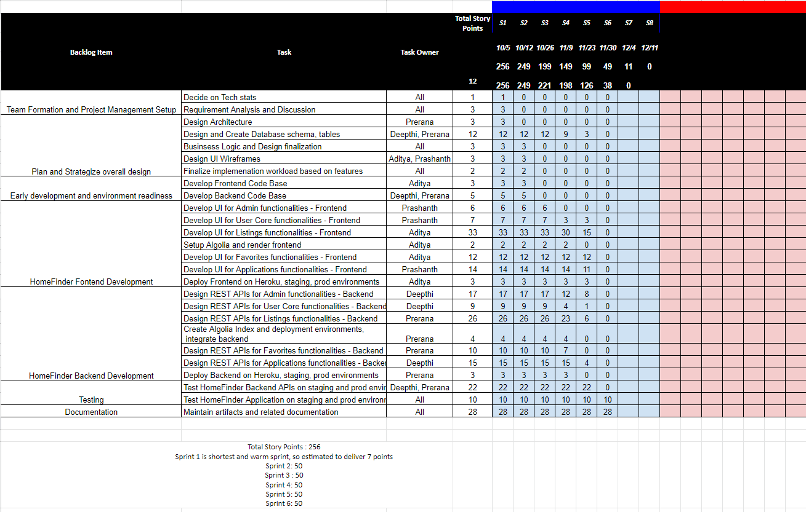
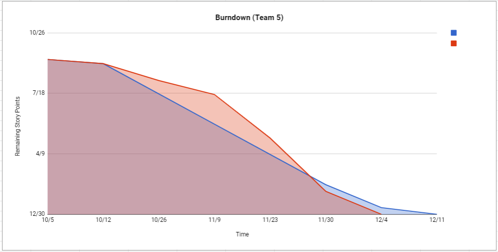

# CMPE 202 Team Project Fall 2020

As part of the final team project we have designed and developed a web application called "HomeFinder" which is a replica of Zillow.
It provides a platform to buy, sell and rent different types of houses.
The design and implemenation includes both frontend and backend applications to support HomeFinder features states in team project requirements.

## Team Members

- Aditya Shah
- Deepthi Jallepalli
- Prashanth Narasimha
- Prerana Shekar

## Technology Stack

* Lucid Charts - For Archeitecture design, DB design

* ReactJS, React Bootstrap, HTML, CSS - Frontend development

* DjangoRESTFul Framework, Python - For backend development

* PostgresSQL - Primary DB

* Algolia - Secondary DB to improvise search performance

* Postman - REST API client to test the developed APIs

* Heroku - Deploy frontend and backend applications, PostgresSQL DB

* Project Management Tools 

  - GitHub - Source code and Project Management 

  - Google Sheet - Task tracking and sprint burndown 

  - Zoom - Team collaboration (Organizing daily scrum and other meetings)
  
  - Slack channel (CMPE-202-Zillow-Clone) - To discuss and share any information related to specific story or issues

## Architecture Diagram

## Database Design

## Depolyment Diagram

## Design Decisions
## Sprint Journal

## XP Core Values

Throughout the project (sprints) we followed below stated XP core values:

- Communication
  * Communication was one of the key strengths of our team. We had weekly calls scheduled for every Monday evening to discuss the functionality, make necessary design decisions and assumptions.  
  * During the call we made sure to understand the progress, dependency on each other and any blockers.
  * We maintained Github projects Kanban Board to maintain the list of ToDo, InProgress, Completed tasks. This also helped us to understand the progress of various tasks throughout the sprint.
  * We had a clear work breakdown, which helped us clearly understand who was working on a specific feature and whom to contact when there was a need or dependency. This also completely eliminated doing any redundant work.
  * We also maintained a slack channel to communicate on a daily basis. Any clarifications regarding frontend and backend communication, rest api endpoints, request-response parameter details and much more was shared with each other on the channel regularly.

- Feedback

  * Feedback also played a very important role during the project development and testing phase. 
  * During the development phase we always pushed our changes to a branch and created pull requests. Once the code was approved by another team member, we pushed the changes to the master branch. We made sure the code changes on the master branch was always stable and did not break the other team member’s code.
  * During the testing phase, we gave feedback to each other by testing the features developed by team members. This helped in identifying the bugs.
  * The constant feedback helped to identify the unknowns and scenarios or features missed during the initial phase of the project. That helped us to make better assumptions and collective decisions.

- Respect
  * Throughout the project, all the team members were respectful of each other’s time, availability and the deliverables deadline.
  * The team was respectful of each other's suggestion in choosing the tools and technologies. Based on the individual's skills and comfort level, the team was accommodative to agree upon the framework utilized and programming languages. Nevertheless, all the team members were enthusiastic to learn and incorporate new software skills.
  * The suggestions about the CQRS architecture, usage of the Algolia database was well accepted and successfully implemented.

- Simplicity 

  * At every step of our project we always evaluated the primary goals to be accomplished inorder to stay focused on what was required in the MVP.
  * We always had a segregation of “must haves” and “if possible”. 
  * We tried to reduce complexity while designing the database, api endpoints and the UI as well.
  * The backend code and database was deployed on Heroku to simply the tasks of other team members. We maintained multiple environments such as staging and production to separate development and production data. CI/CD was set up to ensure all the changes were available on Heroku server as soon as the changes were pushed to master. This enabled the frontend to be directly connected to the backend and database without replicating it in the local.
  * Similarly, the frontend code was always available on another Heroku app, which enabled all the team members to test each other’s code without replicating all the changes in the local. This reduced the efforts involved in constantly taking an update of the changes in local.

## Scrum Dashboard

## Individual Contribution

- Our team work division has two categories, Frontend and Backend application development

- Frontend Application design, implementation and deployments - Aditya Shah and Prashanth Narshima

- Backend Application design, implementation and deployments  - Deepthi Jallepalli and Prerana Shekar

## Task Sheet 

## Burndown Chart

## Delivered APIs and Sample Postman requests and responses
## Acknowldgement
